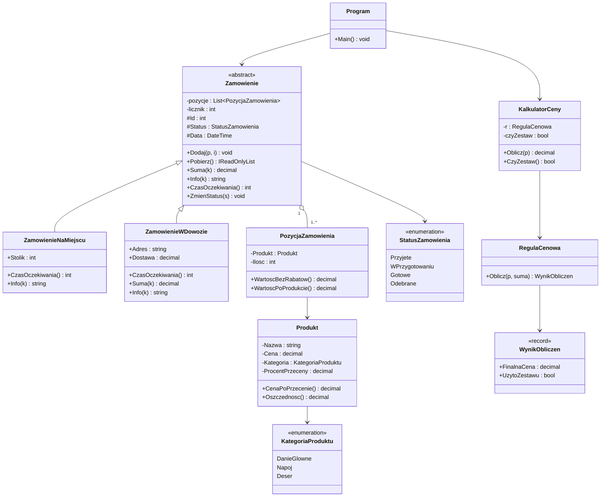

# Polex — system zamówień dla punktu gastronomicznego

Konsolowa aplikacja w C# wspomagająca obsługę zamówień w punkcie gastronomicznym (restauracji, barze szybkiej obsługi).

## Opis projektu

Aplikacja rozwiązuje problem ręcznego przyjmowania i wyceniania zamówień, automatyzując wybór produktów z menu, naliczanie rabatów oraz wyliczanie czasu realizacji zamówienia.

Adresatami są pracownicy obsługi (kelnerzy, osoby przyjmujące zamówienia), którym aplikacja umożliwia:

- rejestrowanie zamówień **na miejscu** (przy stoliku),
- rejestrowanie zamówień **w dowozie** (z adresem dostawy),
- automatyczne wyliczanie należności wraz z obowiązującymi promocjami.

### Główne funkcjonalności

- Wczytywanie menu z pliku `menu.txt` (nazwa, cena, kategoria, % przeceny); plik jest generowany automatycznie przy pierwszym uruchomieniu, jeśli nie istnieje.
- Dwa typy zamówień: na miejscu (numer stolika) i w dowozie (adres + stała opłata za dowóz 12,50 zł).
- Wybór produktów podzielonych na kategorie: dania główne, napoje, desery.
- Rabat **zestawowy** — 10% zniżki na całe zamówienie, jeśli zawiera ono jednocześnie danie główne, napój i deser.
- Porównanie rabatu zestawowego z sumą indywidualnych przecen produktów i zastosowanie wariantu korzystniejszego dla klienta.
- Szacowanie czasu oczekiwania, zależne od typu zamówienia (na miejscu szybciej, dowóz dłużej).
- Zapis historii zamówień do `HistoriaZ.txt` oraz błędów do `errors.log`.

## Architektura i struktura obiektowa

### Diagram klas



### Najważniejsze klasy

| Klasa | Odpowiedzialność |
|---|---|
| `Produkt` | Przechowuje dane pozycji menu i wylicza cenę po przecenie indywidualnej. Właściwości tylko do odczytu (`init`). |
| `PozycjaZamowienia` | Łączy `Produkt` z zamówioną ilością, liczy wartość pozycji z i bez rabatu. |
| `RegulaCenowa` | Logika biznesowa rabatów — sprawdza komplet danie+napój+deser (rabat 10%), porównuje z rabatami produktowymi i wybiera wariant korzystniejszy dla klienta. |
| `WynikObliczen` | Niemutowalny `record` z finalną ceną i informacją, czy użyto zestawu. |
| `KalkulatorCeny` | Pośredniczy między zamówieniem a `RegulaCenowa`, przechowuje info o zastosowanej promocji dla UI. |
| `Zamowienie` (abstrakcyjna) | Wspólny szkielet zamówienia: pozycje, status, ID, data. Definiuje metody wirtualne/abstrakcyjne nadpisywane przez klasy pochodne. |
| `ZamowienieNaMiejscu` | Zamówienie przy stoliku — krótszy czas realizacji (−5 min). |
| `ZamowienieWDowozie` | Zamówienie z dostawą — dłuższy czas realizacji (+10 min) i dodatkowa opłata za dowóz. |
| `Program` | Punkt wejścia, obsługa menu konsolowego, plików menu/historii/błędów. |

### Relacje między klasami

- **Dziedziczenie** — `ZamowienieNaMiejscu` i `ZamowienieWDowozie` dziedziczą po abstrakcyjnym `Zamowienie`, nadpisując metody wirtualne zgodnie ze swoją specyfiką.
- **Kompozycja** — `Zamowienie` jest właścicielem listy `PozycjaZamowienia`; pozycje nie mają sensu istnienia poza konkretnym zamówieniem.
- **Agregacja** — `PozycjaZamowienia` odwołuje się do `Produkt`, który istnieje samodzielnie w menu niezależnie od zamówień.
- **Delegacja** — `KalkulatorCeny` korzysta z `RegulaCenowa` do wykonania obliczeń, rozdzielając "orkiestrację" od logiki biznesowej.

### Uzasadnienie decyzji projektowych

- **Klasa abstrakcyjna `Zamowienie`** eliminuje duplikację kodu wspólnego (pozycje, status, ID) i wymusza, by każda klasa pochodna zaimplementowała własną wersję `Info()`.
- **Wydzielenie `RegulaCenowa` z `KalkulatorCeny`** oddziela logikę decyzyjną od logiki sterującej, co ułatwia dodanie kolejnych reguł cenowych w przyszłości.
- **Rekord `WynikObliczen`** użyty zamiast klasy, ponieważ przenosi tylko dane wynikowe, bez własnej tożsamości i zachowania.
- **Właściwości `init`** w `Produkt` i `PozycjaZamowienia` zabezpieczają dane przed modyfikacją po utworzeniu — zgodnie z zasadą enkapsulacji.
- **`Math.Max` przy wyborze rabatu** gwarantuje, że klient zawsze otrzyma najlepszą możliwą cenę, niezależnie od tego, która promocja akurat ma zastosowanie.

## Uruchomienie i użycie

### Wymagania

- .NET SDK 10.0 lub nowszy

### Visual Studio

1. Otwórz `PolexDowZJedzenia.sln`.
2. Zbuduj rozwiązanie.
3. Uruchom projekt `PolexDowZJedzenia`.

### CLI

```bash
dotnet restore
dotnet build
dotnet run --project PolexDowZJedzenia/PolexDowZJedzenia.csproj
```

### Obsługa programu

Po starcie wyświetlane jest menu główne: **1.** zamówienie na miejscu (numer stolika 1–100), **2.** zamówienie na dowóz (adres), **0.** wyjście. Następnie wybierasz produkty z listy podzielonej na kategorie (wpisując numer i ilość), a `0` zamyka dodawanie pozycji. Na końcu wyświetlane jest podsumowanie z ceną i informacją o ewentualnym rabacie zestawowym, zapisywane też do `HistoriaZ.txt`.

**Pliki używane przez aplikację:** `menu.txt` (lista produktów), `HistoriaZ.txt` (historia zamówień), `errors.log` (log błędów).

## Podział pracy w zespole

Dokumentacja i diagram klas UML — wspólnie, cały zespół.

- **Jan Ryszard Mazurkiewicz** — pozostałe elementy (`Zamowienie` i klasy pochodne, `Program`, obsługa plików) oraz ogólny refactoring kodu.
- **Maciej Pieńkowski** — klasy `PozycjaZamowienia` i `Produkt`.
- **Igor Stanisław Białobrzeski** — klasy `KalkulatorCeny`, `RegulaCenowa`, `WynikObliczen` (logika rabatowa).